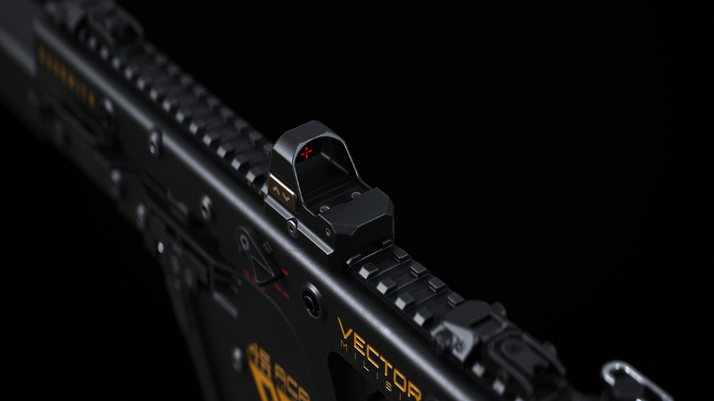

# Portfolio Maintenance Guide

This guide explains how you can manually change, add, or update content on your portfolio website (`index.html` and `stylesheets/style.css`) without needing an AI coding assistant.

---

## 🚀 Hosting & YouTube Embeds (GitHub Pages)

### "Does this work when I host it on GitHub Pages?"
**Yes, perfectly!** 
GitHub Pages is a static hosting platform. Because this website is built with pure HTML, CSS, and Vanilla JavaScript, it executes completely in the visitor's browser. 

* The YouTube embedded videos load directly from YouTube servers via `<iframe>` elements.
* The script that handles card expansion and video swapping runs entirely in the visitor's browser.
* There are **no** backend servers or AI dependencies required. Once you push your changes to your GitHub repository, everything will play and look exactly as it does locally.

---

## ✏️ 1. Updating the Bio & Contact Details

All biographical text and contact badges are located under the `<!-- About Me Section -->` in `index.html`.

### Updating Biography Text
Look for the `<p>` tag inside the `.about-main` div:
```html
<p>
    Hi, I'm an Unreal Engine Generalist...
</p>
```
Simply edit the text inside this tag.

### Changing Social Links & Usernames
Each contact item is defined by an `<a>` link or `<div>` wrapper containing an SVG icon and the label:
* **Email**: Change both the `href="mailto:your_email@gmail.com"` and the text label to update your contact email.
* **Discord**: Update the text label (e.g. `nazgul101`) inside the `<div class="contact-item">` container.
* **GitHub, LinkedIn, ArtStation, YouTube**: Edit the `href="..."` attribute to point to your new URL profile link.

---

## 🛠️ 2. Modifying Roles & Experience Timeline

The timeline is a visual list of your past positions inside the `.timeline-section` container:
```html
<div class="experience-timeline">
    <div class="timeline-item">
        <div class="timeline-marker"></div>
        <div class="timeline-date">Oct 2025 - Present</div>
        <div class="timeline-role">C++ Programmer</div>
    </div>
    <!-- Additional timeline-items -->
</div>
```

### How to add a new role:
1. Copy one of the `<div class="timeline-item">` blocks.
2. Paste it at the **top** of the `.experience-timeline` list (to show the most recent role first).
3. Change the text inside the `.timeline-date` tag (e.g. `Nov 2026 - Present`) and `.timeline-role` tag (e.g. `Senior Gameplay Programmer`).

---

## 🏷️ 3. Updating the Tech Stack Badges

The skills are listed inside the `.tech-grid` container as simple, visually styled `<span>` elements:
```html
<div class="tech-grid">
    <span class="tech-badge">Unreal Engine</span>
    <span class="tech-badge">Godot</span>
    <!-- ... -->
</div>
```
* **To add a skill**: Paste a new `<span class="tech-badge">Your Skill</span>` line in the grid list.
* **To remove a skill**: Delete the span line of the skill you want to remove.
* **To reorder**: Drag or rearrange the lines in `index.html` as desired.

---

## 📂 4. Updating Project Cards

Project cards are structured as cards within `.cards-grid` in the Professional Work and Personal Projects sections.

### Structure of a Standard Project Card (With Video)
```html
<div class="project-card" data-video-id="YOUTUBE_VIDEO_ID">
    <div class="project-thumbnail">
        
    </div>
    <div class="project-info">
        <div class="project-header-row">
            <h3 class="project-title">Project Name</h3>
            <span class="expand-icon">...</span>
        </div>
    </div>
    <div class="project-details">
        <span class="project-role-tag">Role: Your Roles here</span>
        <p class="project-description">
            Description of the project.
        </p>
        <div class="video-wrapper">
            <iframe src="" title="Video title" ...></iframe>
        </div>
    </div>
</div>
```
* **Card default video**: The `data-video-id="YOUTUBE_VIDEO_ID"` attribute on the `.project-card` determines what video ID loads in the iframe when the card is clicked/opened.
* **Thumbnails**: The `` source points to the images directory (e.g., `assets/thumbnail_bns.jpg`). Make sure to place any new images in the `assets/` folder and update this path.

### Structure of a Static Card (No Video, e.g. Weapon Pack or Colombo Race)
If a project has no video, simply **omit** the `data-video-id` attribute and the `.video-wrapper` div inside `.project-details`.
```html
<div class="project-card">
    <div class="project-thumbnail">
        
    </div>
    <!-- ... info ... -->
    <div class="project-details">
        <p class="project-description">Description text.</p>
        <!-- Optional Link Button -->
        <a href="https://..." class="project-link-btn" target="_blank" rel="noopener noreferrer">
            <span>View on ArtStation</span>
        </a>
    </div>
</div>
```

---

## 🎛️ 5. Setting up Multi-Video Switchers (e.g. SriVerse)

To support multiple videos on a single card, you can add a tab switcher interface:
```html
<div class="video-tabs-container">
    <div class="video-tabs-label">Group Label</div>
    <div class="video-tabs">
        <button class="video-tab-btn active" data-video-id="VIDEO_ID_1">Button Label 1</button>
        <button class="video-tab-btn" data-video-id="VIDEO_ID_2">Button Label 2</button>
    </div>
</div>
```

### Rules for Multi-Video Switcher:
1. Ensure the default video loaded by the card (`data-video-id="..."` on the parent card) matches the video ID of the tab containing the `active` class (`class="video-tab-btn active"`).
2. The custom JavaScript included at the bottom of `index.html` automatically detects these buttons. When a button with `.video-tab-btn` is clicked, the script updates the video source in the player iframe without collapsing the card.
